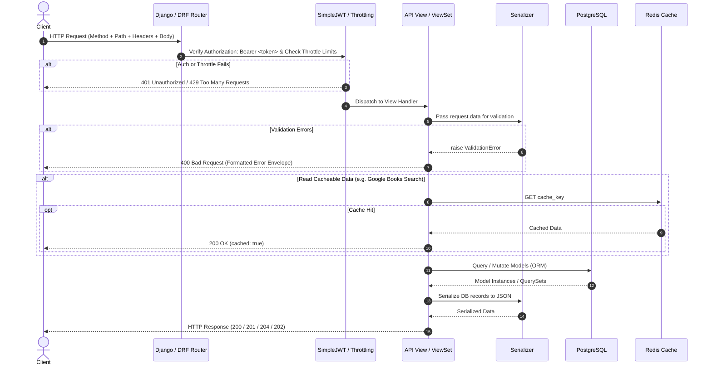
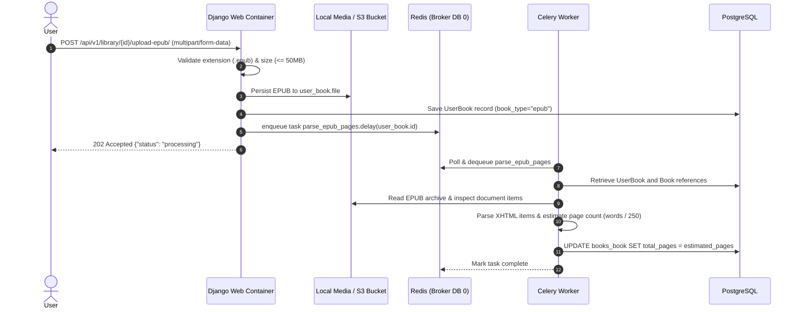
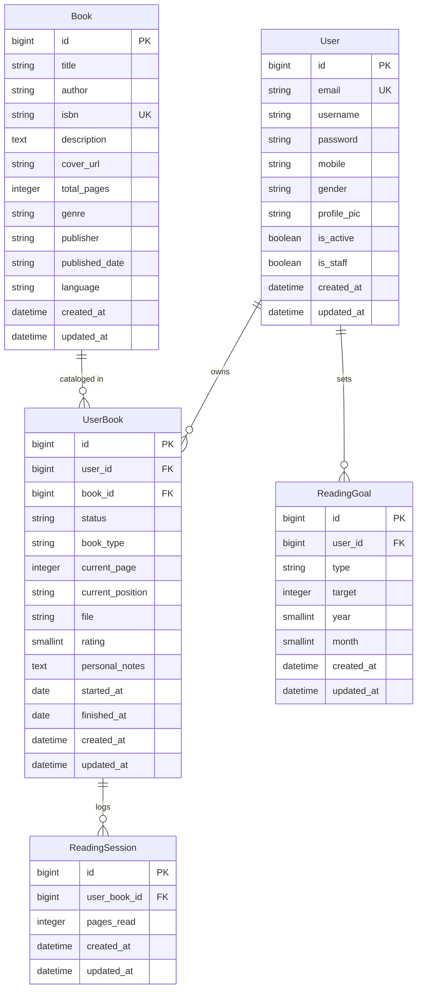

# Cozy Reads API — Architecture & Developer Documentation

> **Cozy Reads API** is a production-grade, headless backend built with **Django 5**, **Django REST Framework (DRF)**, **PostgreSQL**, **Redis**, and **Celery**. It powers the Cozy Reads application, providing book catalog management, Google Books integration, personal reading library tracking, asynchronous EPUB processing, reading goal tracking, and detailed reading analytics.

---

## Table of Contents

1. [System Architecture & Design Patterns](#1-system-architecture--design-patterns)
   - [High-Level Architecture Diagram](#high-level-architecture-diagram)
   - [Architectural Patterns](#architectural-patterns)
   - [Request & Response Lifecycle](#request--response-lifecycle)
   - [Asynchronous Task Lifecycle](#asynchronous-task-lifecycle)
2. [Project & Directory Structure](#2-project--directory-structure)
3. [Applications & Domain Modules](#3-applications--domain-modules)
   - [apps.core](#appscore)
   - [apps.users](#appsusers)
   - [apps.books](#appsbooks)
   - [apps.library](#appslibrary)
   - [apps.epub](#appsepub)
   - [apps.goals](#appsgoals)
   - [apps.stats](#appsstats)
4. [Database Models & Entity-Relationship Schema](#4-database-models--entity-relationship-schema)
   - [Entity Relationship Diagram](#entity-relationship-diagram)
   - [Model Specifications](#model-specifications)
5. [Complete API Reference & Route Definitions](#5-complete-api-reference--route-definitions)
   - [System & Observability Endpoints](#system--observability-endpoints)
   - [Authentication & User Management (`/api/v1/auth/`)](#authentication--user-management-apiv1auth)
   - [Books Catalog & Discovery (`/api/v1/books/`)](#books-catalog--discovery-apiv1books)
   - [Personal Library & Progress Tracking (`/api/v1/library/`)](#personal-library--progress-tracking-apiv1library)
   - [Reading Goals (`/api/v1/goals/`)](#reading-goals-apiv1goals)
   - [Reading Statistics & Analytics (`/api/v1/stats/`)](#reading-statistics--analytics-apiv1stats)
6. [Security, Authentication & Rate Limiting](#6-security-authentication--rate-limiting)
7. [Configuration & Environment Variables](#7-configuration--environment-variables)
8. [Local Development & Docker Setup](#8-local-development--docker-setup)
9. [Code Quality, Testing & CI/CD](#9-code-quality-testing--cicd)
10. [Suggestions, Identified Bugs & Architectural Recommendations](#10-suggestions-identified-bugs--architectural-recommendations)

---

## 1. System Architecture & Design Patterns

### High-Level Architecture Diagram

```mermaid
flowchart TD
    subgraph Clients["Client Layer"]
        SPA["Single Page App (React / Next.js / Vue)"]
        Mobile["Mobile App (iOS / Android)"]
        Ereader["E-Reader Device / Client"]
    end

    subgraph Gateway["Ingress / Gateway"]
        Nginx["Reverse Proxy / Nginx / ALB"]
    end

    subgraph AppServer["Django Application Layer (Gunicorn / runserver)"]
        Router["URL Dispatcher (config/urls.py)"]
        Middleware["Security, CORS, Auth Middlewares"]
        DRF["Django REST Framework Layer"]
        AuthModule["SimpleJWT Auth & Throttles"]
        Views["API Views / ViewSets"]
        Serializers["ModelSerializers & Validators"]
        ORM["Django ORM Models"]
    end

    subgraph Workers["Background Worker Layer"]
        CeleryWorker["Celery Worker (tasks.py)"]
        CeleryBeat["Celery Beat Scheduler"]
    end

    subgraph DataStorage["Data & State Layer"]
        Postgres[(PostgreSQL 16\nRelational Storage)]
        Redis[(Redis 7\nCache DB 1 | Broker DB 0)]
        MediaStorage[("Media Storage\nLocal Media / AWS S3")]
    end

    subgraph ExternalServices["External Services"]
        GoogleBooks["Google Books Volumes API"]
        EmailService["SMTP Gateway / Amazon SES"]
        Sentry["Sentry Error Monitoring"]
    end

    Clients -->|HTTPS / JSON / JWT| Nginx
    Nginx --> Middleware
    Middleware --> Router
    Router --> DRF
    DRF --> AuthModule
    AuthModule --> Views
    Views --> Serializers
    Serializers --> ORM
    ORM -->|TCP / Port 5432| Postgres

    Views -->|Cache Read / Write (DB 1)| Redis
    Views -->|Enqueue Task (DB 0)| Redis
    Redis -->|Consume Task| CeleryWorker
    CeleryBeat -->|Schedule Heartbeat| Redis
    CeleryWorker -->|Update Total Pages| Postgres
    CeleryWorker -->|Read EPUB File| MediaStorage

    Views -->|File Uploads / Avatars| MediaStorage
    Views -->|Volume Search Proxy| GoogleBooks
    Views -->|Transactional Emails| EmailService
    AppServer -.->|Exceptions / Telemetry| Sentry
```

### Architectural Patterns

- **Headless REST API (Model-Serializer-View)**: Decoupled from any frontend presentation. All views return standard JSON payloads. DRF ModelSerializers manage bidirectional translation, validation, and object mutations.
- **Stateless Authentication with JWT**: Uses JSON Web Tokens (`SimpleJWT`). Short-lived access tokens (30 mins) with refresh token rotation and persistent token blacklisting.
- **Layered Multi-Environment Settings**: Split Django configuration (`base.py`, `local.py`, `production.py`, `test.py`) using `django-environ` for 12-factor application design.
- **Envelope Error Handling**: DRF default error formatting is intercepted by a unified handler (`apps.core.exceptions.custom_exception_handler`), guaranteeing that any 4xx/5xx payload follows the `{ "error": { "detail": ..., "status_code": ... } }` schema.
- **Asynchronous Offloading**: Compute-heavy or blocking operations (such as EPUB parsing and token/email operations) are delegated to Celery workers using Redis as the message broker.
- **Proxy Caching**: Google Books search queries are hashed via MD5 and stored in Redis with a 24-hour TTL, mitigating third-party API rate limits and reducing external latency.

### Request & Response Lifecycle



### Asynchronous Task Lifecycle



---

## 2. Project & Directory Structure

```text
cozy-reads-api/
├── manage.py                          # Django CLI entrypoint
├── pytest.ini                         # Pytest configuration (reuse-db, nomigrations)
├── pyproject.toml                     # Ruff & isort configuration
├── .pre-commit-config.yaml            # Pre-commit hooks (ruff, black, isort)
├── docker-compose.yml                 # Multi-container orchestration (db, redis, web, celery, beat)
│
├── config/                            # Project Settings & Root Routing
│   ├── __init__.py
│   ├── asgi.py                        # ASGI entrypoint for async capabilities
│   ├── wsgi.py                        # WSGI entrypoint for web servers (Gunicorn)
│   ├── celery.py                      # Celery application initialization & auto-discovery
│   ├── urls.py                        # Root URL configuration (admin, docs, health, api/v1/)
│   ├── api_v1_urls.py                 # Aggregated API v1 sub-router
│   └── settings/                      # Split environment settings
│       ├── __init__.py
│       ├── base.py                    # Shared core settings (auth, apps, JWT, logging)
│       ├── local.py                   # Development settings (debug toolbar, CORS allow all)
│       ├── production.py              # Hardened settings (SSL, Sentry, S3, WhiteNoise)
│       └── test.py                    # Fast test settings (locmem cache, MD5 hasher)
│
├── requirements/                      # Environment-specific package dependencies
│   ├── base.txt                       # Django, DRF, SimpleJWT, Celery, psycopg2, EbookLib
│   ├── local.txt                      # pytest, factory-boy, black, isort, ruff, debug-toolbar
│   └── production.txt                 # gunicorn, whitenoise, sentry-sdk, django-storages[boto3]
│
├── docker/                            # Containerization assets
│   └── django/
│       └── Dockerfile                 # Multi-stage production-ready Python 3.12 Dockerfile
│
├── apps/                              # Modular Domain Applications
│   ├── core/                          # Common domain utilities, models, permissions & handlers
│   │   ├── apps.py                    # Core application config
│   │   ├── models.py                  # BaseModel (abstract: created_at, updated_at)
│   │   ├── permissions.py             # IsOwner object-level authorization permission
│   │   ├── exceptions.py              # Custom DRF exception handler (consistent error envelope)
│   │   └── views.py                   # /health/ readiness & liveness probe
│   │
│   ├── users/                         # User Authentication, Profile & Identity
│   │   ├── admin.py                   # Custom UserAdmin with profile fieldsets
│   │   ├── apps.py                    # Users application config
│   │   ├── models.py                  # Custom User model (email as USERNAME_FIELD)
│   │   ├── serializers.py             # Register, User, PasswordChange, PasswordReset serializers
│   │   ├── urls.py                    # /api/v1/auth/ routes
│   │   ├── views.py                   # Login, Register, Me, PasswordReset views
│   │   └── tests/                     # Auth test suite and FactoryBoy user definitions
│   │
│   ├── books/                         # Global Book Catalog & Discovery
│   │   ├── admin.py                   # BookAdmin model registration
│   │   ├── apps.py                    # Books application config
│   │   ├── models.py                  # Book entity (ISBN, title, author, total_pages, cover)
│   │   ├── serializers.py             # BookSerializer
│   │   ├── services.py                # Google Books API client & Redis cache key generator
│   │   ├── urls.py                    # /api/v1/books/ routes & DefaultRouter
│   │   └── views.py                   # BookViewSet & BookSearchExternalView
│   │
│   ├── library/                       # User Personal Library & Reading Progress
│   │   ├── admin.py                   # UserBookAdmin with list filters
│   │   ├── apps.py                    # Library application config
│   │   ├── models.py                  # UserBook & ReadingSession models
│   │   ├── serializers.py             # UserBookSerializer & UpdateProgressSerializer
│   │   ├── urls.py                    # /api/v1/library/ routes
│   │   ├── views.py                   # UserBookViewSet (upload_epub, progress actions)
│   │   └── tests/                     # Library factories
│   │
│   ├── epub/                          # EPUB File Parsing & Background Processing
│   │   ├── apps.py                    # Epub application config
│   │   └── tasks.py                   # Celery task parse_epub_pages (word count & page estimate)
│   │
│   ├── goals/                         # Reading Goals & Progress Engine
│   │   ├── admin.py                   # ReadingGoalAdmin
│   │   ├── apps.py                    # Goals application config
│   │   ├── models.py                  # ReadingGoal model (annual_books, monthly_pages)
│   │   ├── serializers.py             # ReadingGoalSerializer with conditional validation
│   │   ├── urls.py                    # /api/v1/goals/ routes
│   │   └── views.py                   # GoalViewSet & progress calculation action
│   │
│   └── stats/                         # Reading Analytics & Visualization Data
│       ├── apps.py                    # Stats application config
│       ├── urls.py                    # /api/v1/stats/ routes
│       └── views.py                   # Summary, ByMonth, ByGenre aggregation views
│
└── .github/workflows/
    └── ci.yml                         # Automated GitHub Actions (Lint, Test, Docker Build)
```

---

## 3. Applications & Domain Modules

### `apps.core`
- **`BaseModel`**: Abstract model inherited by all persistent domain entities (`Book`, `UserBook`, `ReadingSession`, `ReadingGoal`). Provides `created_at` and `updated_at` timestamps with default descending timestamp ordering (`ordering = ["-created_at"]`).
- **`IsOwner`**: Object-level DRF permission ensuring users can only read or mutate records matching `obj.user_id == request.user.id`.
- **`custom_exception_handler`**: Wraps DRF's standard handler to enforce a strict error format across all endpoints:
  ```json
  {
    "error": {
      "detail": "Descriptive error message or field error map",
      "status_code": 400
    }
  }
  ```
- **`health_check`**: Direct Django view at `/health/` executing raw SQL (`SELECT 1`) and cache operations (`cache.set`/`cache.get`) to provide instant health state (HTTP 200 vs 503) for Docker, Kubernetes, and uptime probes.

### `apps.users`
- Implements a custom user model inheriting from Django's `AbstractUser`.
- `email` replaces `username` as the primary `USERNAME_FIELD` (must be unique).
- Extended profile attributes: `mobile`, `gender` (choices: `male`, `female`, `other`, `prefer_not_to_say`), and `profile_pic` (saved to `avatars/`).
- Full authentication lifecycle:
  - Account registration with password strength verification.
  - JWT token pair issuance (access + refresh) with bruteforce rate limiting (`5/min`).
  - Refresh token rotation and instant blacklisting on logout.
  - Profile retrieval and partial updates (`/me/`).
  - Secure password changes for authenticated sessions.
  - Two-step password reset flow via time-limited base64 tokens with email anti-enumeration protection (always returns 200).

### `apps.books`
- Centralized, de-duplicated book catalog shared across all users.
- Attributes: `title`, `author`, `isbn` (indexed, unique), `description`, `cover_url`, `total_pages`, `genre`, `publisher`, `published_date`, `language`.
- Permission model: Public read access (`AllowAny` for list and retrieve), authenticated creation (`IsAuthenticated`), and staff-only mutations (`IsAdminUser` for update and delete).
- **Google Books Integration** (`services.py`):
  - Queries Google Books Volume API with optional qualifiers (`title`, `author`, `isbn`).
  - Caches formatted search results in Redis with MD5 digest keys (`google_books:search:{md5}`) for 24 hours.
  - Throttled at `30/min` per authenticated user.

### `apps.library`
- Personal user library entries (`UserBook`) linking a `User` to a `Book`.
- **Enforced uniqueness**: A user cannot add the same book to their library twice (`unique_together = ("user", "book")`).
- Status State Machine:
  - `want_to_read` (Default)
  - `reading` (Automatically flipped on first page progress)
  - `finished` (When reading concludes, recorded with `finished_at`)
- Formats: `physical` or `epub`.
- Reading Progress & Logging:
  - Incremental page updates create immutable `ReadingSession` records containing `pages_read` (the positive delta).
  - Supports bookmark tracking via `current_position` (string bookmark or EPUB CFI).
- File Storage: EPUB files are uploaded to `epubs/%Y/%m/` and trigger asynchronous parsing.

### `apps.epub`
- Dedicated asynchronous worker module.
- Background Celery task `parse_epub_pages(user_book_id)`:
  - Loads the EPUB file via `ebooklib.epub`.
  - Iterates over document items (ITEM_DOCUMENT / type 9).
  - Calculates the total word count and estimates standard pages (~250 words per page).
  - Updates `Book.total_pages` in the database.

### `apps.goals`
- Enables users to set personal reading targets (`ReadingGoal`).
- Supported goal types:
  - `annual_books`: Number of completed books targeted for a calendar year (`year` required, `month` must be null).
  - `monthly_pages`: Number of pages read targeted for a specific month (`year` and `month` 1–12 required).
- Dynamic progress calculation (`/api/v1/goals/progress/`):
  - For `annual_books`: Counts `UserBook` entries marked `finished` in that year.
  - For `monthly_pages`: Sums all `ReadingSession.pages_read` logged within that specific month.
  - Computes exact completion percentages (clamped to 100.0%).

### `apps.stats`
- Analytics and reporting service:
  - **Summary (`/stats/summary/`)**: Total books read, total pages read, favorite genre, and current reading streak in days.
  - **Monthly Breakdown (`/stats/by-month/`)**: Chronological aggregate of books finished and pages read grouped by month (`TruncMonth`).
  - **Genre Distribution (`/stats/by-genre/`)**: Book completion count aggregated by genre.

---

## 4. Database Models & Entity-Relationship Schema

### Entity Relationship Diagram



### Model Specifications

| Model | Table | Fields & Constraints | Description |
| :--- | :--- | :--- | :--- |
| **`User`** | `users_user` | `id` (PK), `email` (Unique), `username`, `mobile`, `gender`, `profile_pic`, `is_staff`, `is_active`, `created_at`, `updated_at` | Primary user identity entity. Uses email for login. |
| **`Book`** | `books_book` | `id` (PK), `title`, `author`, `isbn` (Unique, Indexed), `description`, `cover_url`, `total_pages`, `genre`, `publisher`, `published_date`, `language`, timestamps | Global book catalog. Inherits `BaseModel`. |
| **`UserBook`** | `library_userbook` | `id` (PK), `user_id` (FK User), `book_id` (FK Book), `status`, `book_type`, `current_page`, `current_position`, `file`, `rating`, `personal_notes`, `started_at`, `finished_at`, timestamps.<br>**Constraint**: `UNIQUE(user_id, book_id)`.<br>**Index**: `[user, status]` | Pivot record managing a user's progress on an individual book. |
| **`ReadingSession`** | `library_readingsession` | `id` (PK), `user_book_id` (FK UserBook), `pages_read`, timestamps.<br>**Index**: `[user_book, created_at]` | Historical log of incremental page advances. |
| **`ReadingGoal`** | `goals_readinggoal` | `id` (PK), `user_id` (FK User), `type`, `target`, `year`, `month`, timestamps.<br>**Constraint**: `UNIQUE(user_id, type, year, month)` | Target metrics per user per calendar period. |

---

## 5. Complete API Reference & Route Definitions

All API endpoints are prefixed with `/api/v1/` unless specified otherwise. All requests and responses use `application/json` unless marked as `multipart/form-data`.

### Standard Error Envelope
Whenever any request returns an HTTP status code outside of `2xx`, the response body follows this contract:
```json
{
  "error": {
    "detail": "Human-readable explanation of error or dictionary of field validation errors",
    "status_code": 400
  }
}
```

---

### System & Observability Endpoints

#### 1. System Health Check
- **Endpoint**: `GET /health/`
- **Auth**: None (Public)
- **Description**: Verifies PostgreSQL database connectivity (`SELECT 1`) and Redis cache connectivity (`cache.set`/`get`).
- **Response**:
  - `200 OK`:
    ```json
    {
      "status": "ok",
      "db": "ok",
      "cache": "ok"
    }
    ```
  - `503 Service Unavailable`:
    ```json
    {
      "status": "error",
      "db": "error",
      "cache": "ok"
    }
    ```

#### 2. Interactive API Documentation (Swagger)
- **Endpoint**: `GET /docs/`
- **Auth**: None (Public)
- **Description**: Interactive OpenAPI 3.0 Swagger UI documentation.

#### 3. OpenAPI Schema
- **Endpoint**: `GET /schema/`
- **Auth**: None (Public)
- **Description**: Raw YAML/JSON OpenAPI 3.0 specification download.

#### 4. Django Administration
- **Endpoint**: `GET /admin/`
- **Auth**: Staff / Superuser session
- **Description**: Django Admin interface for model management.

---

### Authentication & User Management (`/api/v1/auth/`)

#### 1. Register User
- **Endpoint**: `POST /api/v1/auth/register/`
- **Auth**: `AllowAny`
- **Request Body**:
  ```json
  {
    "email": "reader@example.com",
    "username": "cozyreader",
    "password": "StrongPassword123!",
    "password2": "StrongPassword123!",
    "mobile": "+1234567890",
    "gender": "prefer_not_to_say"
  }
  ```
- **Validation**:
  - `email` must be unique and valid.
  - `password` and `password2` must match.
  - Standard Django password validation rules apply.
- **Response**: `201 Created`
  ```json
  {
    "email": "reader@example.com",
    "username": "cozyreader",
    "mobile": "+1234567890",
    "gender": "prefer_not_to_say"
  }
  ```

#### 2. Obtain JWT Token Pair (Login)
- **Endpoint**: `POST /api/v1/auth/login/`
- **Auth**: `AllowAny`
- **Rate Limit**: `5/min`
- **Request Body**:
  ```json
  {
    "email": "reader@example.com",
    "password": "StrongPassword123!"
  }
  ```
- **Response**: `200 OK`
  ```json
  {
    "access": "eyJhbGciOiJIUzI1NiIsInR5cCI6IkpXVCJ9...",
    "refresh": "eyJhbGciOiJIUzI1NiIsInR5cCI6IkpXVCJ9..."
  }
  ```

#### 3. Refresh Access Token
- **Endpoint**: `POST /api/v1/auth/refresh/`
- **Auth**: `AllowAny`
- **Request Body**:
  ```json
  {
    "refresh": "eyJhbGciOiJIUzI1NiIsInR5cCI6IkpXVCJ9..."
  }
  ```
- **Behavior**: Because `ROTATE_REFRESH_TOKENS=True` and `BLACKLIST_AFTER_ROTATION=True`, this endpoint returns a brand new access token *and* a new refresh token, while invalidating the old refresh token.
- **Response**: `200 OK`
  ```json
  {
    "access": "eyJhbGciOiJIUzI1NiIsInR5cCI6IkpXVCJ9...",
    "refresh": "eyJhbGciOiJIUzI1NiIsInR5cCI6IkpXVCJ9..."
  }
  ```

#### 4. Logout (Blacklist Refresh Token)
- **Endpoint**: `POST /api/v1/auth/logout/`
- **Auth**: `IsAuthenticated` (Bearer Header)
- **Request Body**:
  ```json
  {
    "refresh": "eyJhbGciOiJIUzI1NiIsInR5cCI6IkpXVCJ9..."
  }
  ```
- **Response**: `205 Reset Content`

#### 5. Get Current User Profile
- **Endpoint**: `GET /api/v1/auth/me/`
- **Auth**: `IsAuthenticated`
- **Response**: `200 OK`
  ```json
  {
    "id": 1,
    "email": "reader@example.com",
    "username": "cozyreader",
    "mobile": "+1234567890",
    "gender": "prefer_not_to_say",
    "profile_pic": "/media/avatars/default.png",
    "created_at": "2026-09-01T12:00:00Z",
    "updated_at": "2026-09-01T12:00:00Z"
  }
  ```

#### 6. Update User Profile
- **Endpoint**: `PATCH /api/v1/auth/me/`
- **Auth**: `IsAuthenticated`
- **Request Body**: Any subset of editable fields (`mobile`, `gender`, `profile_pic`):
  ```json
  {
    "mobile": "+9876543210",
    "gender": "female"
  }
  ```
- **Response**: `200 OK` (returns updated user object)

#### 7. Change Password
- **Endpoint**: `POST /api/v1/auth/change-password/`
- **Auth**: `IsAuthenticated`
- **Request Body**:
  ```json
  {
    "old_password": "CurrentPassword123!",
    "new_password": "NewStrongPassword456!",
    "new_password2": "NewStrongPassword456!"
  }
  ```
- **Response**: `200 OK`
  ```json
  {
    "detail": "Password updated successfully."
  }
  ```

#### 8. Request Password Reset Token
- **Endpoint**: `POST /api/v1/auth/password-reset/`
- **Auth**: `AllowAny`
- **Rate Limit**: `3/min`
- **Request Body**:
  ```json
  {
    "email": "reader@example.com"
  }
  ```
- **Behavior**: Dispatches an email with `uid` and signed `token`. Never leaks whether the email is registered.
- **Response**: `200 OK`
  ```json
  {
    "detail": "If that email is registered, a reset link has been sent."
  }
  ```

#### 9. Confirm Password Reset
- **Endpoint**: `POST /api/v1/auth/password-reset/confirm/`
- **Auth**: `AllowAny`
- **Rate Limit**: `10/min`
- **Request Body**:
  ```json
  {
    "uid": "MQ",
    "token": "cg3e37-fbfb45f479427b03a1d9426f4eecf719",
    "new_password": "BrandNewPassword789!",
    "new_password2": "BrandNewPassword789!"
  }
  ```
- **Response**: `200 OK`
  ```json
  {
    "detail": "Password has been reset. You can now log in."
  }
  ```

---

### Books Catalog & Discovery (`/api/v1/books/`)

#### 1. Search External Google Books Catalog
- **Endpoint**: `GET /api/v1/books/search-external/`
- **Auth**: `IsAuthenticated`
- **Rate Limit**: `30/min`
- **Query Parameters**:
  - `q` (string, required): Search query.
  - `type` (string, optional): One of `title` (default), `author`, or `isbn`.
- **Cache**: 24 hours in Redis.
- **Response**: `200 OK`
  ```json
  {
    "results": [
      {
        "google_books_id": "zyTCAlFPjgYC",
        "title": "The Hobbit",
        "author": "J.R.R. Tolkien",
        "isbn": "9780547928227",
        "description": "Bilbo Baggins is a hobbit who enjoys a comfortable, unambitious life...",
        "cover_url": "http://books.google.com/books/content?id=zyTCAlFPjgYC...",
        "total_pages": 320,
        "genre": "Fiction",
        "publisher": "Houghton Mifflin Harcourt",
        "published_date": "2012-09-18",
        "language": "en"
      }
    ],
    "cached": false
  }
  ```

#### 2. List Internal Books
- **Endpoint**: `GET /api/v1/books/`
- **Auth**: `AllowAny`
- **Query Parameters**:
  - `genre` (string, optional): Filter by exact genre.
  - `language` (string, optional): Filter by language code.
  - `search` (string, optional): Case-insensitive search on `title` or `author`.
  - `page` (int, optional): Page number (Page size = 20).
- **Response**: `200 OK` (Standard DRF PageNumberPagination)
  ```json
  {
    "count": 42,
    "next": "http://localhost:8000/api/v1/books/?page=2",
    "previous": null,
    "results": [
      {
        "id": 1,
        "title": "The Hobbit",
        "author": "J.R.R. Tolkien",
        "isbn": "9780547928227",
        "description": "Bilbo Baggins...",
        "cover_url": "http://books.google.com/...",
        "total_pages": 320,
        "genre": "Fantasy",
        "publisher": "Houghton Mifflin",
        "published_date": "2012",
        "language": "en",
        "created_at": "2026-09-01T12:00:00Z",
        "updated_at": "2026-09-01T12:00:00Z"
      }
    ]
  }
  ```

#### 3. Create Book
- **Endpoint**: `POST /api/v1/books/`
- **Auth**: `IsAuthenticated`
- **Request Body**:
  ```json
  {
    "title": "Project Hail Mary",
    "author": "Andy Weir",
    "isbn": "9780593135204",
    "description": "Ryland Grace is the sole survivor on a desperate, last-chance mission...",
    "cover_url": "https://example.com/cover.jpg",
    "total_pages": 496,
    "genre": "Science Fiction",
    "publisher": "Ballantine Books",
    "published_date": "2021-05-04",
    "language": "en"
  }
  ```
- **Response**: `201 Created`

#### 4. Retrieve Book
- **Endpoint**: `GET /api/v1/books/{id}/`
- **Auth**: `AllowAny`
- **Response**: `200 OK`

#### 5. Update / Delete Book
- **Endpoints**:
  - `PUT /api/v1/books/{id}/`
  - `PATCH /api/v1/books/{id}/`
  - `DELETE /api/v1/books/{id}/`
- **Auth**: `IsAdminUser` (Staff only)
- **Response**: `200 OK` or `204 No Content`

---

### Personal Library & Progress Tracking (`/api/v1/library/`)

All operations in this section are scoped strictly to the authenticated caller via `IsOwner` permission.

#### 1. List User's Library
- **Endpoint**: `GET /api/v1/library/`
- **Auth**: `IsAuthenticated`
- **Query Parameters**:
  - `status` (string, optional): Filter by `want_to_read`, `reading`, or `finished`.
  - `book_type` (string, optional): Filter by `physical` or `epub`.
- **Response**: `200 OK`
  ```json
  {
    "count": 1,
    "next": null,
    "previous": null,
    "results": [
      {
        "id": 10,
        "book": {
          "id": 1,
          "title": "The Hobbit",
          "author": "J.R.R. Tolkien",
          "isbn": "9780547928227",
          "cover_url": "http://books.google.com/...",
          "total_pages": 320,
          "genre": "Fantasy"
        },
        "status": "reading",
        "book_type": "physical",
        "current_page": 45,
        "current_position": "Chapter 3",
        "rating": 5,
        "personal_notes": "Loving the adventure so far!",
        "started_at": "2026-09-02",
        "finished_at": null,
        "created_at": "2026-09-02T10:00:00Z",
        "updated_at": "2026-09-03T14:20:00Z"
      }
    ]
  }
  ```

#### 2. Add Book to Personal Library
- **Endpoint**: `POST /api/v1/library/`
- **Auth**: `IsAuthenticated`
- **Request Body**:
  ```json
  {
    "book_title": "Clean Code",
    "book_author": "Robert C. Martin",
    "book_isbn": "9780132350884",
    "status": "want_to_read",
    "book_type": "physical"
  }
  ```
- **Behavior**:
  - If `book_isbn` is provided, looks up or automatically creates the master `Book` record.
  - Automatically associates the entry with the logged-in user.
  - Throws `400 Bad Request` if the book already exists in the user's library.
- **Response**: `201 Created`

#### 3. Retrieve UserBook Entry
- **Endpoint**: `GET /api/v1/library/{id}/`
- **Auth**: `IsAuthenticated, IsOwner`
- **Response**: `200 OK`

#### 4. Update UserBook Metadata
- **Endpoint**: `PATCH /api/v1/library/{id}/`
- **Auth**: `IsAuthenticated, IsOwner`
- **Request Body**:
  ```json
  {
    "status": "finished",
    "rating": 5,
    "personal_notes": "A masterpiece of fantasy fiction.",
    "finished_at": "2026-09-07"
  }
  ```
- **Response**: `200 OK`

#### 5. Remove Book from Library
- **Endpoint**: `DELETE /api/v1/library/{id}/`
- **Auth**: `IsAuthenticated, IsOwner`
- **Response**: `204 No Content`

#### 6. Upload EPUB File
- **Endpoint**: `POST /api/v1/library/{id}/upload-epub/`
- **Auth**: `IsAuthenticated, IsOwner`
- **Content-Type**: `multipart/form-data`
- **Form Data**:
  - `file`: EPUB binary file (must end in `.epub`, maximum size 50 MB)
- **Behavior**:
  - Saves file to storage.
  - Sets `book_type = "epub"`.
  - Enqueues background Celery task `parse_epub_pages.delay(user_book.id)`.
- **Response**: `202 Accepted`
  ```json
  {
    "detail": "Upload accepted, processing page count.",
    "status": "processing"
  }
  ```

#### 7. Update Reading Progress
- **Endpoint**: `PATCH /api/v1/library/{id}/progress/`
- **Auth**: `IsAuthenticated, IsOwner`
- **Request Body**:
  ```json
  {
    "current_page": 80,
    "current_position": "Chapter 5, paragraph 12"
  }
  ```
- **Behavior**:
  - Computes `delta = new_page - old_page`.
  - If `delta > 0`, automatically logs an immutable `ReadingSession(user_book=..., pages_read=delta)` for analytics.
  - If `status == "want_to_read"`, automatically transitions `status` to `"reading"` and sets `started_at` to today.
- **Response**: `200 OK` (returns updated UserBook representation)

---

### Reading Goals (`/api/v1/goals/`)

#### 1. List Goals
- **Endpoint**: `GET /api/v1/goals/`
- **Auth**: `IsAuthenticated, IsOwner`
- **Response**: `200 OK`
  ```json
  [
    {
      "id": 1,
      "type": "annual_books",
      "target": 24,
      "year": 2026,
      "month": null,
      "created_at": "2026-01-01T00:00:00Z",
      "updated_at": "2026-01-01T00:00:00Z"
    },
    {
      "id": 2,
      "type": "monthly_pages",
      "target": 1000,
      "year": 2026,
      "month": 9,
      "created_at": "2026-09-01T00:00:00Z",
      "updated_at": "2026-09-01T00:00:00Z"
    }
  ]
  ```

#### 2. Create Goal
- **Endpoint**: `POST /api/v1/goals/`
- **Auth**: `IsAuthenticated, IsOwner`
- **Request Body (Annual Books)**:
  ```json
  {
    "type": "annual_books",
    "target": 30,
    "year": 2026
  }
  ```
- **Request Body (Monthly Pages)**:
  ```json
  {
    "type": "monthly_pages",
    "target": 1200,
    "year": 2026,
    "month": 9
  }
  ```
- **Validation**:
  - If `type == "monthly_pages"`, `month` is required (1–12).
  - If `type == "annual_books"`, `month` must be null or omitted.
- **Response**: `201 Created`

#### 3. Update / Delete Goal
- **Endpoints**:
  - `GET /api/v1/goals/{id}/`
  - `PUT /api/v1/goals/{id}/`
  - `PATCH /api/v1/goals/{id}/`
  - `DELETE /api/v1/goals/{id}/`
- **Auth**: `IsAuthenticated, IsOwner`
- **Response**: `200 OK` or `204 No Content`

#### 4. Get Goal Progress & Completion Metrics
- **Endpoint**: `GET /api/v1/goals/progress/`
- **Auth**: `IsAuthenticated, IsOwner`
- **Description**: Calculates live goal completion by aggregating finished UserBooks (for annual books) and ReadingSessions (for monthly pages).
- **Response**: `200 OK`
  ```json
  [
    {
      "id": 1,
      "type": "annual_books",
      "year": 2026,
      "month": null,
      "target": 24,
      "completed": 8,
      "percent": 33.3
    },
    {
      "id": 2,
      "type": "monthly_pages",
      "year": 2026,
      "month": 9,
      "target": 1000,
      "completed": 450,
      "percent": 45.0
    }
  ]
  ```

---

### Reading Statistics & Analytics (`/api/v1/stats/`)

All statistics are scoped exclusively to the authenticated user's reading activity.

#### 1. Overall Summary
- **Endpoint**: `GET /api/v1/stats/summary/`
- **Auth**: `IsAuthenticated`
- **Description**: Returns aggregate metrics including total finished books, cumulative pages read, favorite genre, and current reading streak.
- **Response**: `200 OK`
  ```json
  {
    "books_read": 14,
    "total_pages_read": 4820,
    "favourite_genre": "Science Fiction",
    "current_streak_days": 3
  }
  ```

#### 2. Progress Grouped By Month
- **Endpoint**: `GET /api/v1/stats/by-month/`
- **Auth**: `IsAuthenticated`
- **Description**: Returns time-series data of books completed and pages read grouped by month.
- **Response**: `200 OK`
  ```json
  [
    {
      "month": "2026-07",
      "books": 3,
      "pages": 950
    },
    {
      "month": "2026-08",
      "books": 5,
      "pages": 1620
    },
    {
      "month": "2026-09",
      "books": 2,
      "pages": 640
    }
  ]
  ```

#### 3. Breakdown Grouped By Genre
- **Endpoint**: `GET /api/v1/stats/by-genre/`
- **Auth**: `IsAuthenticated`
- **Description**: Aggregates finished books grouped by genre in descending order.
- **Response**: `200 OK`
  ```json
  [
    {
      "genre": "Science Fiction",
      "books": 6
    },
    {
      "genre": "Fantasy",
      "books": 5
    },
    {
      "genre": "Non-Fiction",
      "books": 3
    }
  ]
  ```

---

## 6. Security, Authentication & Rate Limiting

### Authentication Architecture
- **JWT Provider**: `rest_framework_simplejwt`
- **Access Tokens**:
  - Cryptographically signed with `DJANGO_SECRET_KEY` using HMAC-SHA256.
  - Carries `user_id` payload.
  - Validity: **30 minutes**.
- **Refresh Tokens**:
  - Validity: **7 days**.
  - **Rotation Enabled**: Requesting a refreshed token issues a new refresh token and immediately invalidates the former.
  - **Blacklisting**: `rest_framework_simplejwt.token_blacklist` prevents reuse of consumed or logged-out tokens.

### Scoped Rate Limiting (Throttling)
Uses DRF's `ScopedRateThrottle` backed by Redis to prevent brute-force attacks and abuse:
| Scope | Configured Rate | Targeted Endpoint |
| :--- | :--- | :--- |
| `login` | `5 / minute` | `POST /api/v1/auth/login/` |
| `password-reset` | `3 / minute` | `POST /api/v1/auth/password-reset/` |
| `password-reset-confirm` | `10 / minute` | `POST /api/v1/auth/password-reset/confirm/` |
| `books-search-external` | `30 / minute` | `GET /api/v1/books/search-external/` |

### Production Security Headers
In production (`config/settings/production.py`):
- `SECURE_SSL_REDIRECT = True`
- `SECURE_HSTS_SECONDS = 31536000` (1 year)
- `SECURE_HSTS_INCLUDE_SUBDOMAINS = True`
- `SECURE_HSTS_PRELOAD = True`
- `SESSION_COOKIE_SECURE = True`
- `CSRF_COOKIE_SECURE = True`

---

## 7. Configuration & Environment Variables

Environment variables are loaded via `django-environ` from a root `.env` file.

| Variable | Type | Default (Local) | Purpose |
| :--- | :--- | :--- | :--- |
| `DJANGO_SETTINGS_MODULE` | string | `config.settings.local` | Determines settings file (`local`, `production`, `test`). |
| `DJANGO_SECRET_KEY` | string | Dev fallback secret | Secret cryptographic signing key. Must be randomized in production. |
| `DEBUG` | boolean | `True` (local) / `False` (prod) | Toggles Django debug mode and detailed error traces. |
| `DJANGO_ALLOWED_HOSTS` | list | `localhost, 127.0.0.1` | Comma-separated list of valid host/domain names. |
| `DATABASE_URL` | string | `postgres://cozy:cozy@db:5432/cozy_reads` | PostgreSQL connection string. |
| `REDIS_URL` | string | `redis://redis:6379/1` | Redis connection URL for application caching. |
| `CELERY_BROKER_URL` | string | `redis://redis:6379/0` | Redis queue URL for Celery task dispatch. |
| `CELERY_RESULT_BACKEND` | string | `redis://redis:6379/0` | Redis backend URL for Celery task results. |
| `CORS_ALLOWED_ORIGINS` | list | `http://localhost:3000` | Allowed origins for Cross-Origin Resource Sharing. |
| `GOOGLE_BOOKS_API_KEY` | string | `""` (optional) | Optional Google Cloud API key for higher Google Books API limits. |
| `AWS_STORAGE_BUCKET_NAME` | string | `""` | S3 bucket name for production static/media storage. |
| `AWS_S3_REGION_NAME` | string | `""` | AWS region (e.g. `us-east-1`). |
| `SENTRY_DSN` | string | `""` | Sentry telemetry DSN for automated exception capture. |
| `EMAIL_BACKEND` | string | `console.EmailBackend` | Mail backend (`smtp.EmailBackend` in production). |
| `EMAIL_HOST` | string | `smtp.gmail.com` | SMTP relay server host. |
| `EMAIL_PORT` | integer | `587` | SMTP relay port (typically 587 for TLS). |
| `EMAIL_USE_TLS` | boolean | `True` | Whether to initiate TLS upgrade on email connection. |
| `EMAIL_HOST_USER` | string | `""` | SMTP authentication user. |
| `EMAIL_HOST_PASSWORD` | string | `""` | SMTP authentication password or app password. |
| `DEFAULT_FROM_EMAIL` | string | `noreply@cozyreads.app` | Outgoing sender address for system notification emails. |

---

## 8. Local Development & Docker Setup

### Prerequisites
- [Docker](https://docs.docker.com/get-docker/) & [Docker Compose](https://docs.docker.com/compose/)
- [Python 3.12](https://www.python.org/downloads/) (if running outside Docker)

### Quick Start with Docker (Recommended)

1. **Clone & Prepare Environment Variables**:
   ```bash
   git clone <repository-url>
   cd cozy-reads-api
   cp .env.example .env
   ```

2. **Build and Launch All Containers**:
   ```bash
   docker-compose up --build
   ```
   This initializes 5 coordinated services:
   - `db`: PostgreSQL 16 (port `5432`)
   - `redis`: Redis 7 (port `6379`)
   - `web`: Django API server with hot-reloading (port `8000`)
   - `celery`: Background worker processing async tasks
   - `celery-beat`: Scheduler for periodic jobs

3. **Apply Database Migrations**:
   ```bash
   docker-compose exec web python manage.py migrate
   ```

4. **Create Superuser (Admin)**:
   ```bash
   docker-compose exec web python manage.py createsuperuser
   ```

5. **Verify Running System**:
   - Health Probe: [http://localhost:8000/health/](http://localhost:8000/health/)
   - Interactive Swagger Docs: [http://localhost:8000/docs/](http://localhost:8000/docs/)
   - Django Admin: [http://localhost:8000/admin/](http://localhost:8000/admin/)

---

## 9. Code Quality, Testing & CI/CD

### Running the Test Suite
The project utilizes `pytest` with `pytest-django` and `factory-boy`.

- **Inside Docker**:
  ```bash
  docker-compose exec web pytest -v
  ```
- **Locally**:
  ```bash
  DJANGO_SETTINGS_MODULE=config.settings.test pytest -v
  ```

### Linting & Formatting
Code formatting and linting are strictly enforced using `ruff`, `black`, and `isort`:

```bash
# Run Ruff lint checks
ruff check .

# Check formatting with Black
black --check .

# Check import ordering with isort
isort --check-only .
```

### GitHub Actions CI Workflow
Every push and pull request to `main` triggers `.github/workflows/ci.yml`:
1. **Lint Job**: Validates code standard via Ruff, Black, and isort.
2. **Test Job**: Boots isolated Postgres 16 and Redis 7 service containers, applies migrations, and executes `pytest`.
3. **Build Job**: Verifies that the multi-stage `Dockerfile` compiles cleanly.

---

## 10. Suggestions, Identified Bugs & Architectural Recommendations

During a deep-dive analysis of the codebase, several bugs, edge cases, and high-value architectural improvements were identified. Addressing these will ensure production readiness and prevent unexpected runtime failures.

---

### ⚠️ Identified Bugs & Fixes

#### 1. Runtime `NameError` in `apps/library/views.py` (Line 98)
- **Issue**: In `UserBookViewSet.progress`:
  ```python
  if user_book.status == "want_to_read":
      user_book.status = "reading"
      user_book.started_at = user_book.started_at or timezone.now().date()
  ```
  `timezone` is **not imported** in `apps/library/views.py`. When an authenticated user updates progress on a book currently in `"want_to_read"`, the server crashes with `NameError: name 'timezone' is not defined`. Linting did not catch this because of `# flake8:noqa` at line 1.
- **Fix**:
  ```python
  # In apps/library/views.py
  from django.utils import timezone
  ```

#### 2. Cloud Storage Incompatibility in Celery Task (`apps/epub/tasks.py`)
- **Issue**: In `parse_epub_pages`:
  ```python
  book = epub.read_epub(user_book.file.path)
  ```
  In local development, `user_book.file.path` returns a filesystem path. However, in production (`production.py`), Django uses S3 storage (`storages.backends.s3boto3.S3Boto3Storage`). Calling `.path` on remote storage raises `NotImplementedError: This backend doesn't support absolute paths.`
- **Fix**: Download the file contents into a temporary file or stream:
  ```python
  import tempfile
  from celery import shared_task
  from ebooklib import epub

  @shared_task(bind=True, max_retries=2)
  def parse_epub_pages(self, user_book_id):
      from apps.library.models import UserBook
      try:
          user_book = UserBook.objects.get(id=user_book_id)
      except UserBook.DoesNotExist:
          return

      try:
          with tempfile.NamedTemporaryFile(suffix=".epub") as temp_file:
              with user_book.file.open("rb") as remote_file:
                  for chunk in remote_file.chunks():
                      temp_file.write(chunk)
              temp_file.flush()
              book = epub.read_epub(temp_file.name)
              word_count = 0
              for item in book.get_items_of_type(9):
                  word_count += len(item.get_content().split())
              estimated_pages = max(1, word_count // 250)
      except Exception as exc:
          raise self.retry(exc=exc, countdown=10)

      user_book.book.total_pages = estimated_pages
      user_book.book.save(update_fields=["total_pages"])
  ```

#### 3. Raw HTML / Markup Inflating EPUB Word Counts (`apps/epub/tasks.py`)
- **Issue**: `item.get_content()` returns raw byte strings of the XHTML documents inside the EPUB. Splitting by whitespace (`split()`) treats XML attributes, CSS classes, and tags (`<div class="chapter-body">`, `<p style="...">`, etc.) as words, inflating the estimated page count by 20%–50%.
- **Fix**: Strip HTML tags using an HTML parser (such as `html.parser` or regex text extraction) before splitting words:
  ```python
  import re

  def extract_text_from_html(raw_bytes):
      text = raw_bytes.decode("utf-8", errors="ignore")
      # Strip HTML tags
      clean_text = re.sub(r"<[^>]+>", " ", text)
      return clean_text.split()
  ```

#### 4. Ignored Book Fields in `UserBookSerializer` (`apps/library/serializers.py`)
- **Issue**: In `UserBookSerializer.create`, `validated_data.pop("book_cover_url", "")`, `book_description`, `book_genre`, `book_publisher`, and `book_total_pages` are extracted. However, those fields are **never declared** on `UserBookSerializer` (only `book_title`, `book_isbn`, `book_author` are declared as write-only fields). As a result, DRF automatically ignores those keys during deserialization, and master books created from the library endpoint lose their cover, genre, and total page information.
- **Fix**: Declare all write-only book fields on `UserBookSerializer`:
  ```python
  class UserBookSerializer(serializers.ModelSerializer):
      book = BookSerializer(read_only=True)
      book_title = serializers.CharField(write_only=True, required=False)
      book_author = serializers.CharField(write_only=True, required=False, allow_blank=True)
      book_isbn = serializers.CharField(write_only=True, required=False, allow_blank=True)
      book_cover_url = serializers.URLField(write_only=True, required=False, allow_blank=True)
      book_description = serializers.CharField(write_only=True, required=False, allow_blank=True)
      book_genre = serializers.CharField(write_only=True, required=False, allow_blank=True)
      book_publisher = serializers.CharField(write_only=True, required=False, allow_blank=True)
      book_total_pages = serializers.IntegerField(write_only=True, required=False, min_value=1)
      # ...
  ```

#### 5. PostgreSQL Duplicate Annual Goals (`apps/goals/models.py`)
- **Issue**: `ReadingGoal` defines `unique_together = ("user", "type", "year", "month")`. In SQL and PostgreSQL, `NULL != NULL`. For `annual_books` goals, `month` is `NULL`. Consequently, the database allows a user to create multiple annual goals for the same year!
- **Fix**: Add a partial UniqueConstraint in Django:
  ```python
  class Meta:
      constraints = [
          models.UniqueConstraint(
              fields=["user", "type", "year"],
              condition=models.Q(month__isnull=True),
              name="unique_annual_reading_goal",
          ),
          models.UniqueConstraint(
              fields=["user", "type", "year", "month"],
              condition=models.Q(month__isnull=False),
              name="unique_monthly_reading_goal",
          ),
      ]
  ```

---

### 💡 High-Value Architectural & UX Recommendations

#### 1. Reading Streak Metric Calculation (`apps/stats/views.py`)
- **Current Behavior**: `_current_streak` calculates consecutive days where a user *finished an entire book* (`finished_at`). Because finishing a whole book every day is unrealistic for most readers, users will almost always see a streak of 0 or 1.
- **Recommendation**: Base streak calculation on **reading activity** using `ReadingSession` (which logs every time a user reads pages). Calculate consecutive days with at least one `ReadingSession`:
  ```python
  session_dates = set(
      ReadingSession.objects.filter(user_book__user=request.user)
      .values_list("created_at__date", flat=True)
  )
  streak = 0
  day = timezone.now().date()
  # Allow streak continuation if read yesterday even if today's session hasn't occurred yet
  if day not in session_dates and (day - timedelta(days=1)) in session_dates:
      day -= timedelta(days=1)

  while day in session_dates:
      streak += 1
      day -= timedelta(days=1)
  ```

#### 2. Automatic Book Completion on Progress Update
- **Current Behavior**: When `current_page >= book.total_pages`, the book remains in `status = "reading"`.
- **Recommendation**: In `UserBookViewSet.progress`, automatically set `status = "finished"` and populate `finished_at = timezone.now().date()` if `book.total_pages` is set and `new_page >= book.total_pages`.

#### 3. Test Suite Expansion
- **Current Coverage**: Tests only exist for `apps/users/tests/test_auth.py`.
- **Recommendation**: Add integration tests for:
  - `apps/books`: Mocking Google Books API proxy and verifying Redis caching.
  - `apps/library`: Verifying `ReadingSession` creation, status transitions, and ownership isolation.
  - `apps/goals`: Verifying progress calculation for both monthly and annual targets.
  - `apps/stats`: Verifying monthly truncation and genre aggregation.

#### 4. EPUB File Parsing Status Feedback
- **Current Behavior**: `upload_epub` returns `202 Accepted`, but the client has no way of knowing whether the background worker succeeded, failed, or is still parsing.
- **Recommendation**: Add an `epub_status` field on `UserBook` (`choices=["pending", "ready", "failed"]`) so frontend clients can display a progress spinner and know if an uploaded file was corrupt.
